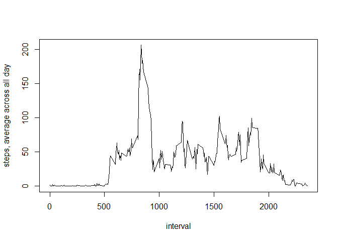

# Reproducible Research: Peer Assessment 1


## Loading and preprocessing the data

clear workspace

```r
rm(list=ls())
```
unzip the file

```r
unzip("./activity.zip")
```
Load the data

```r
data <- read.csv("./activity.csv")
```
show the first data

```r
head(data)
```

```
##   steps       date interval
## 1    NA 2012-10-01        0
## 2    NA 2012-10-01        5
## 3    NA 2012-10-01       10
## 4    NA 2012-10-01       15
## 5    NA 2012-10-01       20
## 6    NA 2012-10-01       25
```


## What is mean total number of steps taken per day?

delet missing values

```r
df <- na.omit(data)
```
aggregate by days to get total number of steps per day

```r
library(dplyr)
```

```
## Warning: package 'dplyr' was built under R version 3.1.3
```

```
## 
## Attaching package: 'dplyr'
## 
## The following object is masked from 'package:stats':
## 
##     filter
## 
## The following objects are masked from 'package:base':
## 
##     intersect, setdiff, setequal, union
```

```r
res <- df %>%
    group_by(date) %>%
    summarize(steps_per_day = sum(steps))
```
Make a histogram of the total number of steps taken each day

```r
hist(res$steps_per_day, main = "Histogram of total number of steps taken each day",
     xlab = "total number of steps per day")
```

 
Calculate and report the mean and median total number of steps taken per day

```r
summary(res$steps_per_day)
```

```
##    Min. 1st Qu.  Median    Mean 3rd Qu.    Max. 
##      41    8841   10760   10770   13290   21190
```


## What is the average daily activity pattern?
Make a time series plot (i.e. type = "l") of the 5-minute interval (x-axis)
and the average number of steps taken, averaged across all days (y-axis)

```r
res_daily <- aggregate(steps ~ interval, df, mean)
plot(x = res_daily$interval, y = res_daily$steps, type = "l",
     xlab = "interval", ylab = "steps, average across all day")
```

 
Which 5-minute interval, on average across all the days in the dataset, 
contains the maximum number of steps?

```r
res_daily[which.max(res_daily$steps),]
```

```
##     interval    steps
## 104      835 206.1698
```
The interval 835 has the daily maximum of 206.1698 steps

## Imputing missing values
Calculate and report the total number of missing values in the 
dataset (i.e. the total number of rows with NAs)

```r
summary(data$steps)
```

```
##    Min. 1st Qu.  Median    Mean 3rd Qu.    Max.    NA's 
##    0.00    0.00    0.00   37.38   12.00  806.00    2304
```
The total number of NA's is 2304.


Devise a strategy for filling in all of the missing values in the dataset.
use daily average for missing interval

```r
average_NA <- data %>%
    group_by(interval) %>%
    summarize(daily_average = mean(steps, na.rm = TRUE))
```
Create a new dataset that is equal to the original dataset but with the missing data filled in.

```r
data_filled <- merge(data, average_NA)
nas <- is.na(data_filled$steps)
data_filled$steps[nas] <- data_filled$daily_average[nas]
summary(data_filled$steps)
```

```
##    Min. 1st Qu.  Median    Mean 3rd Qu.    Max. 
##    0.00    0.00    0.00   37.38   27.00  806.00
```
Make a histogram of the total number of steps taken each day and Calculate and report the mean and median total number of steps taken per day. Do these values differ from the estimates from the first part of the assignment? What is the impact of imputing missing data on the estimates of the total daily number of steps?

```r
res_data_filled <- data_filled %>%
    group_by(date) %>%
    summarize(steps_per_day = sum(steps))
```
Make a histogram of the total number of steps taken each day

```r
hist(res_data_filled$steps_per_day, main = "Histogram of total number of steps taken each day",
     xlab = "total number of steps per day")
```

 
Calculate and report the mean and median total number of steps taken per day

```r
summary(res_data_filled$steps_per_day)
```

```
##    Min. 1st Qu.  Median    Mean 3rd Qu.    Max. 
##      41    9819   10770   10770   12810   21190
```
The impact is low. With the method used, the mean is not effected. The median
changes from 10760(with NA's) to 10770 (without NA's)


## Are there differences in activity patterns between weekdays and weekends?

```r
daytype <- function(date) {
    if (weekdays(as.Date(date)) %in% c("Samstag", "Sonntag")) {
        "weekend"
    } else {
        "weekday"
    }
}
data_filled$daytype <- as.factor(sapply(data_filled$date, daytype))

res_daytype <- data_filled %>%
    group_by(interval, daytype) %>%
    summarize(total_steps = sum(steps))
```
Make a plot to compare weekdays and weekends

```r
library(lattice)
xyplot(res_daytype$total_steps ~ res_daytype$interval | res_daytype$daytype, type = "l", layout = c(1, 2), xlab = "Interval", ylab = "Number of steps")
```

 
  It looks like the proband is sleeping longer on weekends ;-)
